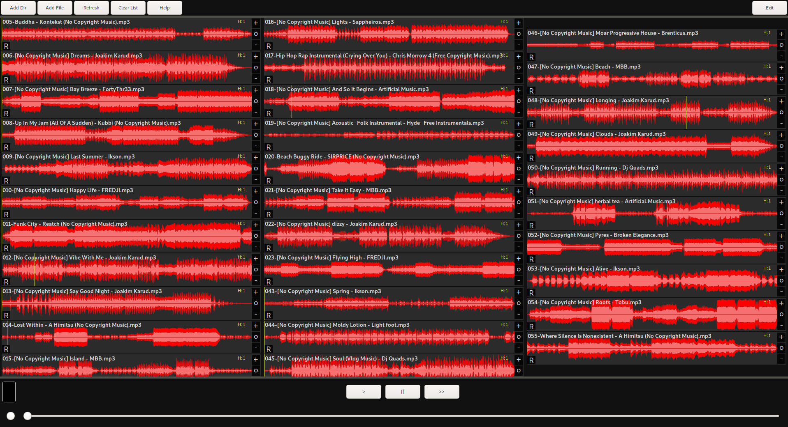

# WaveViewPlayer #

*Linux Version v0.1*

This is a restart of another WaveViewPlayer-Project I did. It has the same
codebase as before but some tweaks here and there.

WVP is a cross-platform mp3/wav audiofile viewer. It is supposed to give
creators and others a visual overview for their audiofiles.

Imagine yourself editing a video and relying on a ton of soundfiles/sfx.
They are often labeled the same way "xxx-splash.mp3" and hundreds of variations
with the same suffix.
The idea is, that humans often are faster in recognizing patterns/images than
bland text. If you can imagine what I am talking about, this might be an
application for you.

### USED LIBRARIES ###

* wxWidgets
* tinyxml2
* mpg123

## Supported OS ##

* Windows 10
* Linux

## Supported Features ##

* **Drag&Drop** to/from WVP <-> from folders/to Editingtools
* **Zooming** into audiofiles
* **Adj.Height** of soundwaveforms
* **Play** audiofiles
* **Sessionsystem** manage playlists or use this as a way to store a session
  for a specific project you might be working on

## Planned Features ##

* **Toggle** between simple soundwave and frequency presentation
* **Tagbased** searching/sorting of audiofiles
* Any ideas that benefit the idea of 'finding' an audiofile one might be
interested in are greatly appreciated.

## CURRENT ##

This program is in its earliest shoes. I am right now focused on
implementing the basic necessary features. Later down the road will come 
performance enhancements and a little more _style_ to all of it.

## VERSIONS ##
* v0.5 ~ Bugfixes, stability, performance, less UI-clutter
* v0.4 ~ Sessionsystem implementation
* v0.3 ~ Bugfixes and better support for wav-files
* v0.2 ~ Lots of Bugfixes, better performance and more accurate drawing
* v0.1 ~ First alpha build with rudimentary functionalties

## INSTALLING FOR LINUX ##

* Coming soon...

### LICENSE ###

* All WVP-Code is released under GNU GPLv3 license
* Other code in this repo released under its respective license
