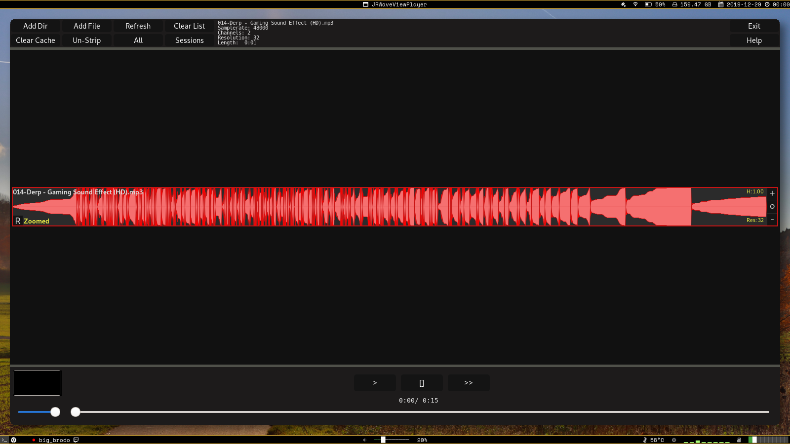

# WaveViewPlayer #

*Linux Version v0.5*

This is a restart of another WaveViewPlayer-Project I did. It has the same
codebase as before but some tweaks here and there.

WVP is a cross-platform mp3/wav audiofile viewer. It is supposed to give
creators and others a visual overview for their audiofiles.

Imagine yourself editing a video and relying on a ton of soundfiles/sfx.
They are often labeled the same way "xxx-splash.mp3" and hundreds of variations
with the same suffix.
The idea is, that humans often are faster in recognizing patterns/images than
bland text. If you can imagine what I am talking about, this might be an
application for you.

### USED LIBRARIES ###

* wxWidgets
* tinyxml2
* mpg123

## Supported OS ##

* Windows 10
* Linux

## Supported Features ##

* **Drag&Drop** to/from WVP <-> from folders/to Editingtools
* **Zooming** into audiofiles
* **Adj.Height** of soundwaveforms
* **Play** audiofiles
* **Sessionsystem** manage playlists or use this as a way to store a session
  for a specific project you might be working on

## Planned Features ##

* **Toggle** between simple soundwave and frequency presentation
* **Tagbased** searching/sorting of audiofiles
* Any ideas that benefit the idea of 'finding' an audiofile one might be
interested in are greatly appreciated.

## CURRENT ##

This program is in its earliest shoes. I am right now focused on
implementing the basic necessary features. Later down the road will come 
performance enhancements and a little more _style_ to all of it.

## VERSIONS ##
* v0.5 ~ Bugfixes, stability, performance, less UI-clutter
* v0.4 ~ Sessionsystem implementation
* v0.3 ~ Bugfixes and better support for wav-files
* v0.2 ~ Lots of Bugfixes, better performance and more accurate drawing
* v0.1 ~ First alpha build with rudimentary functionalties

## INSTALLING FOR LINUX ##

Make sure cmake and ninja are installed. Furthermore wxwidgets, tinyxml2 and mpg123 are needed to build this application. If you are set follow these steps:

Clone the repo

  `git clone https://gitlab.com/NackterZeuS/WaveViewPlayer.git`

Create a build directory and cd into it

  `mkdir build && cd build`

Let cmake and ninja do their job

  `cmake ../ -GNinja`
  
  `ninja`

The final binary will be in the same folder called "WaveViewPlayer". From here on, create a symlink or whatever to make it accessible in your PATH. Get creative.

## BASIC USAGE ##

On each item in the list, different actions can be performed. When hovering over a track with your mouse-cursor, certain extra buttons will appear. Everything can be done with keyboard shortcuts.

As seen in the picture below, each item has its *name*, *height* and current *resolution*.
The *resolution* is simply how many samples per pixel are used, to draw the waveform.
Another feature below is the ability to "zoom" into a specific part of the waveform by holding shift and dragging the cursor from left to right.

Doing preceding operation might break the visual representation of the waveform due to the fact that less samples than pixels are available. Fixing this automatically will come in a next patch (:
If one has the desire to reduce or increase the *resolution* a context-menu can be created by right clicking.

Different preset resolutions can be used.

Above steps can be tedious for alot of files, so if you wish to do that for all of your files in the current session the *strip* button can be used. This action will try to recognize if there are any unnecessary zero values in front and at the end of each sound file, zoom into a "more interesting" part and adapt the resolution if necessary.

### LICENSE ###

* All WVP-Code is released under GNU GPLv3 license
* Other code in this repo released under its respective license
